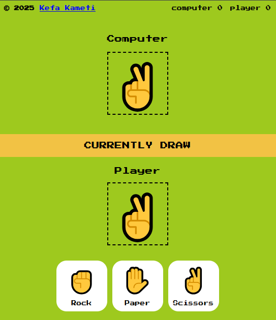

# Rock, Paper and Scissors Game 🎮

A simple and responsive Rock-Paper-Scissors game built using HTML, CSS and JavaScript.




## 🛠️ Key Features

- Computer randomly selects rock, paper or scissors.
- User can interact with the user interface to select either rock, paper or scissors.
- Results are displayed when one opponent wins.

## Getting Started

To run this project Locally:

### Step 1: Clone the repo

```bash
git clone https://github.com/KE-FA/RPS-Game.git
```

### Step 2: Navigate into the project folder

```bash
cd RPS-Game
```

### Step 3: Install dependencies

```bash
npm install
```

### Step 4: Run the development server

```bash
npm run dev
```